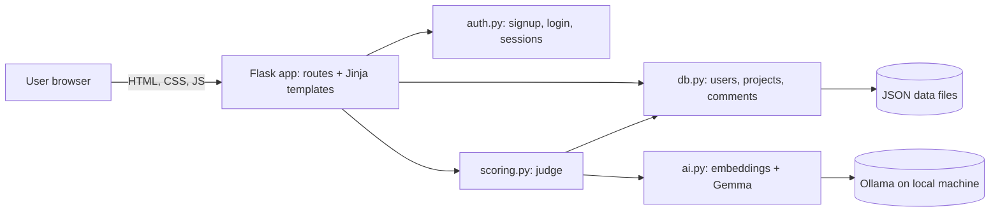

# IDEANET

> A social platform for hackathon innovators to connect, showcase projects and achievements, check originality, and discover how original their ideas are through AI-powered analysis.

## Team

**Team Name:** Tesseract Testers

| Member | Contribution |
|---|---|
| Jatin Naga Sai Batchu | Backend and Database |
| Lakshanya Ilan Sezhiyan | Frontend |
| Akshitha Venkatesh Devithulasimani | Login, Data and Git Captain |
| Aakaash V | AI Engineer |

## Problem Statement

### The Problem

Hackathon participants often struggle to discover relevant projects, showcase their achievements, and know whether their idea is truly unique because these resources are scattered across different platforms.

### Why We Chose This Problem

We chose this problem because many hackathon ideas are similar to existing projects, making originality difficult to assess. **Ideanet uses AI to compare submitted ideas with existing projects and provide an originality score, helping participants understand how unique their idea is.**

## Solution

Ideanet works like a social network built around hackathons. Each hackathon is an account, ongoing hackathons appear as stories, and each post is a project idea. Before building, a participant can type an idea into the Explore page and instantly get an originality score out of 10, along with the most similar existing projects, what those projects already built, and how the new idea could go further.

### Key Features

- **Originality score:** type an idea and get a 1 to 10 score with a short verdict.
- **Similar projects carousel:** the closest existing projects play like Instagram stories, each showing what is already built and how to improve on it.
- **Hackathon feed ("For you"):** project ideas from hackathons, with ongoing hackathons shown as stories.
- **Accounts and profiles:** sign up, log in, edit your bio, change your password, and see your project days on a calendar.
- **Project pages with comments:** every project has its own page where people can discuss it.
- **Upcoming hackathons:** a scrollable list of hackathons to join next.
- **Light and dark themes** and a layout that works on phones and desktops.

## Innovation and Differentiation

Most hackathon platforms only list projects. Ideanet checks an idea against past and ongoing projects *before* you build it. The score combines two signals: how close the idea is in meaning to existing projects (embeddings), and a judgement from a language model that sees the closest matches and must compare against them directly. Everything runs locally, so ideas are not sent to a cloud AI service.

The wording is deliberate: Ideanet says an idea is *similar to* other projects. It never claims plagiarism or that anything is patented.

## Technical Implementation

### Architecture



### Technology Stack

| Category        | Technologies |
| --------------- | --------------------------- |
| Frontend        | HTML, CSS and JavaScript served as Jinja templates (no framework, no build step), Bricolage Grotesque and Instrument Sans fonts |
| Backend         | Python, Flask |
| Database        | JSON file storage (users, projects, comments) |
| AI / ML         | Gemma (local, via Ollama) and the `nomic-embed-text` embedding model |
| Infrastructure  | Runs locally; Ollama serves the models |
| APIs / Services | Ollama local API (`localhost:11434`) |

### How It Works

1. A visitor signs up or logs in. Passwords are hashed, and the session is stored in a signed cookie.
2. On the Explore page they describe an idea and submit it.
3. The backend turns the idea into an embedding and compares it with the embeddings of existing projects to find the five closest.
4. Gemma is shown the idea and those five projects and returns a score, its reasoning, and what is new about the idea.
5. The two scores are blended and the result page shows the score, the verdict, and the similar projects as a story-style carousel.
6. Projects and comments are saved so the feed and project pages stay up to date.

### Technical Decisions

- **Local AI:** embeddings and Gemma run through Ollama, which keeps ideas private and avoids API keys.
- **Blended score:** the final score is 60% language-model judgement and 40% embedding distance, so a single noisy signal cannot dominate. The embedding thresholds are tunable.
- **Plain Flask and Jinja:** server-rendered pages with a small amount of vanilla JavaScript, so pages work without a build step and the code stays easy to read.
- **JSON storage:** chosen for speed of development and zero setup during the hackathon. It is not meant for heavy concurrent use.
- **Safe login:** one error message for wrong username or wrong password, hashed passwords, and redirects limited to this site.

## Implementation During the Hackathon

Everything in this repository was built during the Hacktoberfest Hack Day in Coimbatore on 8 October 2026: the account system, the AI originality scorer, the storage layer, and the full interface.

### Team Contributions

| Team Member | Role & Contribution |
|---|---|
| **Jatin Naga Sai Batchu** | Developed the server-side architecture and managed data storage |
| **Lakshanya Ilan Sezhiyan** | Designed and implemented the user interface and website experience |
| **Akshitha Venkatesh Devithulasimani** | Handled authentication, data organization, and GitHub repository management |
| **Aakaash V** | Built the AI-based system for evaluating project idea originality |

## Working Application

**Live Application:** [Live URL]

[Add how to open the app and what can be tried: sign up, test an idea on Explore, open a similar project, comment on a project.]

## Demo Video

**Demo Video:** [Video URL]

[Add a short description: sign up, test an idea, watch the score and carousel, open a project page and comment.]

## Open Source and AI Usage

### AI / Models

- **Gemma (via Ollama):** judges originality by comparing a new idea with its closest existing projects and explaining the score.
- **nomic-embed-text (via Ollama):** turns ideas and projects into vectors so similar meaning can be found.
- **Claude (Anthropic):** used as a coding assistant for part of the frontend (templates, styles and scripts), including drafts reviewed and tested by the team.

### Open Source Components

- **Flask:** web framework, routing, sessions and Jinja templates.
- **Werkzeug:** password hashing.
- **Ollama:** runs the local models.
- **httpx and NumPy:** calling Ollama and computing similarity.
- **Bricolage Grotesque and Instrument Sans (Google Fonts, SIL Open Font License):** typography.
- **Dataset:** the project corpus used for comparison is sample data prepared by the team for the demo.

Released under the MIT License. See `LICENSE`.

## Setup and Usage

### Prerequisites

- Python 3.10 or newer
- [Ollama](https://ollama.com) installed and running, with the Gemma and `nomic-embed-text` models pulled

### Installation

```bash
git clone https://github.com/lakshanyailan/TESSERACT.git
cd TESSERACT/Ideanet
python3 -m venv venv
source venv/bin/activate
python3 -m pip install flask httpx numpy python-dotenv
ollama pull nomic-embed-text
ollama pull gemma4
```

### Environment Variables

```env
SECRET_KEY=replace-with-a-long-random-string
```

### Running the Project

```bash
cd Ideanet
python3 -m flask --app app.main run --debug
```

Then open http://127.0.0.1:5000

### Usage

1. Open the app and create an account on the sign up page.
2. On **Explore**, describe an idea and press **Check originality**.
3. Read the score and verdict, then step through the similar projects. Tap one to see what is built and how to improve on it.
4. Use **For you** to browse projects, open a project page and leave a comment.
5. Use **Profile** to edit your bio and change your password.

## Devpost Submission

**Devpost Project:** [Devpost Project URL]

[Add the link to the team's Devpost submission. Make sure the project page is complete and contains the required information, links, media, and team details.]

## Credits and License

### Credits

Built by Team Tesseract Testers at Hacktoberfest Hack Day Coimbatore. Thanks to the Flask, Ollama, Gemma and nomic-embed-text projects, and to Google Fonts for the typefaces.

### License

MIT License. See [LICENSE](LICENSE).

## Submission Checklist

- [x] Project title and description added
- [x] All team members listed
- [x] Problem clearly explained
- [x] Reason for choosing the problem explained
- [x] Solution and key features documented
- [x] Innovation and differentiation explained
- [x] Architecture included
- [x] Technical implementation documented
- [x] Work completed during the hackathon documented
- [x] Team contributions documented
- [ ] Working application is functional
- [ ] Live application link added where applicable
- [ ] Demo video added
- [x] AI and open-source components documented
- [ ] Setup and usage instructions tested
- [ ] Challenges and learnings documented
- [ ] Devpost submission completed
- [ ] Devpost link added
- [x] Credits added
- [x] License added
- [ ] Repository is organized and complete
